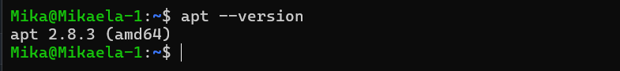

# Assigment 0

1. First step was to create Azure account with my HAMK credentials. I did it on the lesson so there was no problems.
2. Secont step was to request free credits for students.
3. Then we created new virtual machine. Because i folowed instructions on the lecture it was easy. I chose name for it and region, with which was a problem, but after trying few Europe regions, it finally worked on France.Also choosing subscribtion as Azure for students.Choosing x 64 as VM architecture. Then right memory as advised on lecture. I put my short name, Mika, as username. And RSA SSH Format as SSH KeyType.
4. After that going to disk settings, there we check box with Delete with VM and set network sequrity group as Basic, also allowing selected ports.
5. In Managment section we enable auto-shutdown at 7pm by our time zone.
6. After that we didnt change enything else and created VM succesfully.

# Assignment 3:
## Step 1:  Create the Tupu user using the adduser script
In this step we add new Tupu user. Then creating password and info.

>sudo adduser tupu

## Step 2: Create the Lupu user using the useradd command. Try to create a user profile, home directory, and user group similar to Tupu.
We were told to use following code:

>sudo useradd -m -d /home/lupu -s /bin/bash -G lupu lupu

Unfortunately it didn't worked. Giving: useradd: group 'lupu' does not exist. So i used

> sudo groupadd lupu

> sudo useradd -m -d /home/lupu -s /bin/bash -g lupu lupu

> sudo passwd lupu

This way I was able to create lupu user.

## Step 3: Create the Hupu system user with the login shell set to /bin/false
We were advised to use:
>sudo useradd --system --shell /bin/false hupu

I did just that

## Step 4: Add the users Tupu and Lupu to the sudo users.
In this step we had two options. I went with the second option of using:

>sudo usermod -aG sudo tupu

>sudo usermod -aG sudo lupu

## Step 5: Create a directory /opt/projekti and add both users (Tupu and Lupu) as owners. Only Tupu and Lupu should have access to list files in the directory, read, and modify them.
 I created common group for both users:
 >sudo groupadd projekti

 And added them to the group:
 >sudo usermod -aG projekti tupu

 >sudo usermod -aG projekti lupu

 Then assign group ownership:
 >sudo chown root:projekti /opt/projekti

 Then set the directory permissions:
 >sudo chmod 770 /opt/projekti

 After this, setgid bit ensures all newly created files and directories inherit the projekti group:
 >sudo chmod g+s /opt/projekti

 

 ## Step 6: Testing
 ### Test as Tupu:
 >su - tupu

 >cd /opt/projekti

 >touch test_tupup.txt

 >ls -l

### Test as lupu:
>su - lupu

>cd /opt/projekti

>echo "hello" >> test_tupu.txt 

>touch test_lupu.txt

>ls -l

### Test as hupu:
>su - hupu

>cd /opy/projekti

hupu is a unauthorized access so it should so access denied.

# Assignment 6:
## Step 1:
>apt --version

### 1. Check APT Version

This command shows the currently installed version of APT (Advanced Package Tool), which is the package manager used in Ubuntu-based systems.

### 2. Update Package List
>sudo apt update

Purpose:

- Downloads the latest package lists from repositories
- Refreshes system metadata
- Does not install or upgrade any software

### 3. Upgrade Installed Packages
>sudo apt upgrade -y

Difference Between update and upgrade:

| Command       | Description              |
| ------------- | -------------------------- |
| `apt update`  | Refreshes package list     |
| `apt upgrade` | Installs available updates |

#### Simple way to remember:

update = check for updates

upgrade = install updates

### 4. View Pending Updates
>apt list --upgradable

Explanation:
Displays a list of installed packages that have newer versions available.

## Step 2:
#### 1. Search for an Image Editor
>apt search image editor

Selected Package: gimp

#### 2. View Package Details
>apt show gimp

Key Dependencies:

- libgimp2.0t64

- gimp-data

- libc6

- libgtk2.0-0t64

- libpng16-16t64

- libjpeg8

- libtiff6

- libwebp7

- zlib1g

- graphviz

- xdg-utils

Explanation: These dependencies are required for:

- Graphical rendering

- Image processing

- File format support

- System integration

#### 3. Install the Package
>sudo apt install gimp -y

Verify Installation:
>gimp --version

Output Example:
GNU Image Manipulation Program version 2.10.36

#### 4. Check Installed Package Version

>apt list --installed | grep gimp

Output Example:
>gimp/noble-updates,now 2.10.36-3ubuntu0.24.04.1 amd64 [installed]

Additional Installed Packages:

- gimp-data

- libgimp2.0t64

These were installed automatically as dependencies.

## Step 3:
#### 1. Remove a Package
>sudo apt remove gimp -y

#### 2. Purge Configuration Files
>sudo apt purge gimp -y

Difference Between remove and purge Command Removes remove Program files only purge Program + configuration files

#### 3. Remove Unused Dependencies
>sudo apt autoremove -y

Why this is important:

Dependencies remain after uninstalling a package

autoremove cleans unnecessary packages

Helps keep the system clean

#### 4. Clean Cached Files
>sudo apt clean

Removes all cached package files from your system.

## Step 4:
#### 1. List APT Repositories
>cat /etc/apt/sources.list

#### 2. Add Universe Repository
>sudo add-apt-repository universe

What it does:
- Adds the universe repository to your system’s software sources
- Makes thousands of additional open-source packages available
- Updates your system’s repository configuration

#### 3. Simulate Installation Failure
>sudo apt install fakepackage

If Error:

Troubleshooting Steps

- Check spelling:
>apt search fakepackage

- Update package list:
>sudo apt update

- Verify repositories:
>cat /etc/apt/sources.list

- Check internet connection

# Assignment 8:
## Step 1: Firewall Setup
The firewall was configured using to secure the server.

Permitted Services
SSH (OpenSSH Server)
>sudo ufw limit ssh

- Enables remote access via SSH on port 22.
- The limit option restricts the rate of incoming connections, helping to defend against brute-force login attempts and SYN flood attacks.

### Web Server (HTTP)
>sudo ufw limit http

- Allows incoming traffic on port 80 (TCP).
- This makes the web server accessible to users over standard HTTP.

### Secure Web Server (HTTPS)
>sudo ufw limit https

- Allows incoming traffic on port 80 (TCP).
- This makes the web server accessible to users over standard HTTP.

### Secure Web Server (HTTPS)
>sudo ufw limit https

- Opens port 443 (TCP) for encrypted communication.
- Ensures secure data transfer between clients and the server.

## Step 2: Logging Setup
>sudo ufw logging medium

- Activates firewall logging at a medium level.
- Captures blocked traffic and new connection attempts.
- Useful for identifying suspicious behavior, debugging, and monitoring network activity.

#### Log file location:
>/var/log/ufw.log

## Step 3: Protection Against SYN Flood Attacks
>sudo ufw limit ssh

- Controls the rate of incoming TCP connection requests.
- Helps prevent resource exhaustion caused by excessive half-open connections during a SYN flood attack.

## Step 4: Additional Security Measures
#### SSH Brute-Force Defense
>sudo ufw limit ssh

- Detects repeated login attempts from the same IP address.
- Temporarily blocks further attempts if the rate exceeds allowed limits.

## Step 5: Checking Firewall Status
To confirm the configuration, the following command was used:
>sudo ufw status verbose

Resulting configuration includes:
- Incoming traffic: denied by default
- Outgoing traffic: allowed by default
- SSH: rate-limited
- HTTP and HTTPS: permitted
- Logging: enabled (medium level)

# Assignment 8:
## Step 1: Firewall Setup
The firewall was configured using to secure the server.

Permitted Services
SSH (OpenSSH Server)
>sudo ufw limit ssh

- Enables remote access via SSH on port 22.
- The limit option restricts the rate of incoming connections, helping to defend against brute-force login attempts and SYN flood attacks.

### Web Server (HTTP)
>sudo ufw limit http

- Allows incoming traffic on port 80 (TCP).
- This makes the web server accessible to users over standard HTTP.

### Secure Web Server (HTTPS)
>sudo ufw limit https

- Allows incoming traffic on port 80 (TCP).
- This makes the web server accessible to users over standard HTTP.

### Secure Web Server (HTTPS)
>sudo ufw limit https

- Opens port 443 (TCP) for encrypted communication.
- Ensures secure data transfer between clients and the server.

## Step 2: Logging Setup
>sudo ufw logging medium

- Activates firewall logging at a medium level.
- Captures blocked traffic and new connection attempts.
- Useful for identifying suspicious behavior, debugging, and monitoring network activity.

#### Log file location:
>/var/log/ufw.log

## Step 3: Protection Against SYN Flood Attacks
>sudo ufw limit ssh

- Controls the rate of incoming TCP connection requests.
- Helps prevent resource exhaustion caused by excessive half-open connections during a SYN flood attack.

## Step 4: Additional Security Measures
#### SSH Brute-Force Defense
>sudo ufw limit ssh

- Detects repeated login attempts from the same IP address.
- Temporarily blocks further attempts if the rate exceeds allowed limits.

## Step 5: Checking Firewall Status
To confirm the configuration, the following command was used:
>sudo ufw status verbose

Resulting configuration includes:
- Incoming traffic: denied by default
- Outgoing traffic: allowed by default
- SSH: rate-limited
- HTTP and HTTPS: permitted
- Logging: enabled (medium level)

